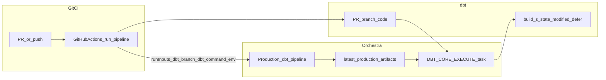

# Orchestra Slim CI — reference index

Consolidated pointers for **orchestra-dbt-slim-ci-setup**. Detail lives in sibling files under `references/` and `templates/`.

## Documentation URLs

| Topic | URL |
|-------|-----|
| CI/CD for dbt Core (Slim CI, latest_production) | https://docs.getorchestra.io/docs/git-control-and-ci-cd/ci-cd/dbt_ci_cd |
| GitHub Actions + run-pipeline | https://docs.getorchestra.io/docs/git-control-and-ci-cd/ci-cd/github_actions |
| dbt Core execute task parameters | https://docs.getorchestra.io/docs/integrations/dbt_core/dbt_core_execute |
| Pipeline inputs | https://docs.getorchestra.io/docs/core-concepts/variables/inputs |
| dbt Core in Orchestra (Git, profiles) | https://docs.getorchestra.io/docs/guides/dbt-core/orchestra-setup |
| Pipeline YAML schema | https://docs.getorchestra.io/docs/core-concepts/pipelines/schema |

## Skill files

| File | Purpose |
|------|---------|
| [inputs-matrix.md](inputs-matrix.md) | Must-have / discoverable / manual inputs |
| [retrofit-checklist.md](retrofit-checklist.md) | Pipeline inventory and YAML patches |
| [mcp-playbook.md](mcp-playbook.md) | Documentation + Orchestra MCP sequence |
| [completion-report.md](completion-report.md) | Report template and troubleshooting |

## Templates

| File | Purpose |
|------|---------|
| [../templates/pipeline-inputs-snippet.yml](../templates/pipeline-inputs-snippet.yml) | Pipeline inputs + dbt task parameters |
| [../templates/github-dbt-slim-ci.yml](../templates/github-dbt-slim-ci.yml) | Minimal GHA workflow |
| [../templates/github-dbt-slim-ci-incremental.yml](../templates/github-dbt-slim-ci-incremental.yml) | Two-command incremental pattern |

## Architecture (one pipeline)

## Companion

Post-setup CI failures: **pr-slim-ci-orchestra-debug** (do not merge into this skill).
